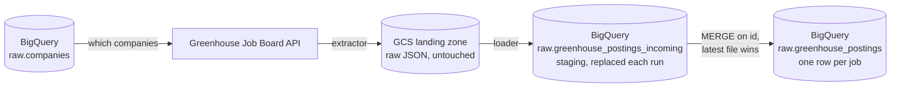

# job-market-pipeline

**Purpose:** help a job seeker find high-quality roles — ones that match what they're
looking for, such as remote-only, country and language — across company career boards.

A batch data pipeline that collects public job postings from applicant-tracking systems
(ATS), lands the raw responses in Google Cloud Storage, and loads them into BigQuery.

**Status:** one source (Greenhouse) in production - 212 company boards, ~20k open jobs,
loaded and quality-checked nightly on Airflow. Six further ATS platforms surveyed and mapped.

## Architecture




1. **Extract** (`ingestion/greenhouse.py`): reads the list of companies to collect from a
  BigQuery registry table and calls Greenhouse's public Job Board API for each one. The
   response bytes are stored unchanged in GCS at
   `greenhouse/ingest_date=YYYY-MM-DD/<company>/<time>.json`.
2. **Load** (`ingestion/greenhouse_loader.py`): lists everything that landed for the day,
  flattens each job into the target schema, and batch-loads all rows into a staging table.
3. **Merge** (`sql/merge_greenhouse_postings.sql`): upserts staging into the final table
  by job `id`.


## Design decisions

- **ELT with an untouched landing zone.** Raw API responses are stored byte for byte,
before any parsing, so anything downstream can be rebuilt from them. A lifecycle rule
deletes landed files after **7 days**, which keeps storage inside the free tier and limits
how far back a rebuild can reach. The landing path is partitioned by date first, then
company, so the loader can process "everything that landed today" without knowing the
company list in advance.
- **The BigQuery raw table is the current state, not the history.** The table holds one row
per job, upserted with `MERGE`, rather than one row per job per run.
`first_seen_at` is set once and `last_seen_at` is updated on every run. This keeps the
table from growing by a near-duplicate copy of every open job each day.
- **Idempotent loads.** BigQuery does not enforce primary keys, so rerunning a naive insert
creates duplicates. Instead, each run fully replaces a staging table (`WRITE_TRUNCATE`)
and then runs `MERGE`, which is safe to repeat.
- **Retries and reruns can't create duplicates.** If an extract runs more than once in a
day, the same job appears in several landed files. Each staging row records `landed_at`
(the GCS object's creation time). The `MERGE` source keeps only the newest copy of each
job (`QUALIFY ROW_NUMBER() OVER (PARTITION BY id ORDER BY landed_at DESC) = 1`), so the
merge never sees two candidates for one target row.
- **Batch load jobs, not streaming inserts.** The data is daily and nothing needs low
latency. Load jobs are also free, which fits a free-tier budget.
- **Explicit schemas.** Tables are created from the DDL in `sql/`, and loads use
`autodetect=False`. With autodetection on, a column that happened to be all `NULL` in a
batch was once inferred as `STRING` instead of the declared `TIMESTAMP`.
- **Configuration comes from the environment.** Bucket and dataset names are never in the
code. They are read from environment variables, and the process fails immediately if one
is missing (`os.environ[...]`, not `.get`). The GCP project comes from the environment's
credentials. SQL that must run against different datasets is a template (`{dataset}`)
that Python fills in, because BigQuery query parameters can't be used for table names.


## Repository layout

```
dags/
  greenhouse_dag.py        Airflow DAG: daily extract -> load, driven by the run's logical date
  hello.py                 minimal example DAG
ingestion/
  greenhouse.py            extract: companies registry -> Greenhouse API -> GCS
  greenhouse_loader.py     load: GCS -> staging table -> MERGE into the final table
sql/
  create_*.sql             table DDL (run once, by hand)
  merge_greenhouse_postings.sql   MERGE template, run by the loader
```


## Running it locally

Requirements: Python 3.13, a GCP project with a GCS bucket and a BigQuery dataset, and
credentials available to the Google client libraries (for example
`gcloud auth application-default login`, or `GOOGLE_APPLICATION_CREDENTIALS` pointing to a
service-account key).

```bash
python -m venv venv && source venv/bin/activate
pip install -r requirements.txt

export NAME_BUCKET=<your-landing-bucket>
export NAME_DATASET=<your-raw-dataset>

# once: create the tables (the DDL uses the dev_raw dataset)
bq query --use_legacy_sql=false < sql/create_dev_raw_companies.sql
bq query --use_legacy_sql=false < sql/create_dev_raw_greenhouse_postings.sql
bq query --use_legacy_sql=false < sql/create_dev_raw_greenhouse_postings_incoming.sql
# then add rows to the companies table: name, external_id (the Greenhouse board slug), ats = 'greenhouse'

python ingestion/greenhouse.py          # extract and land
python ingestion/greenhouse_loader.py   # load and merge
```


## Operations

- **Schedule:** daily at 01:30 UTC (`greenhouse_ingestion`), `catchup=False`. Tasks:
  `extract >> load >> check`.
- **Runs on:** a self-hosted Airflow 3 (Docker, LocalExecutor). Deploys happen automatically
  when `main` changes, after the tests and DAG-import checks pass.
- **Dependencies:** Greenhouse's public Job Board API · a GCS bucket for landed files ·
  BigQuery (`companies` registry in, postings out). No other pipeline depends on this one yet.
- **Retries:** each task retries twice, 5 minutes apart, with a 20-minute timeout. The check
  task does not retry - re-running a check on unchanged data only delays the alert.
- **When it fails:** see [RUNBOOK.md](RUNBOOK.md) - what each failure means, what to check,
  what to do.

## Roadmap

- [x] Greenhouse, multiple companies, end to end, idempotent
- [x] Airflow DAG (self-hosted, Docker) running the daily extract → load → merge
- [x] Hardening: data-quality checks, retries and timeouts, failure alerts, tests, CI/CD, type checking
- [x] Scale to hundreds of companies (batched loads; 5 → 212 boards)
- [ ] More sources: Lever, Ashby, Recruitee, Teamtailor (one request per company), then Workable
      and SmartRecruiters (a request per job, for unseen ids only)
- [ ] dbt: a canonical job model across sources (remote / country / language), marts and tests
- [ ] Separate dev and prod environments
- [ ] Serving layer / dashboard


### Known issues

- **The raw layer is deliberately permissive.** Only what the pipeline itself guarantees is
`NOT NULL` (id, raw payload, timestamps); everything the source provides may be null, because a
`NOT NULL` on someone else's API is a promise that eventually breaks. Completeness is reported
as a fill rate per column on every run instead of blocking the load.
- **Landed files are deleted after 7 days** by a lifecycle rule, so a rebuild can only reach
back that far.
- **Failures are logged, not pushed.** A failure callback writes a structured alert line with
everything needed to act (and `RUNBOOK.md` says what to do), but nothing sends it anywhere yet;
in a team this would post to a chat channel.


## License

MIT, see [LICENSE](LICENSE).