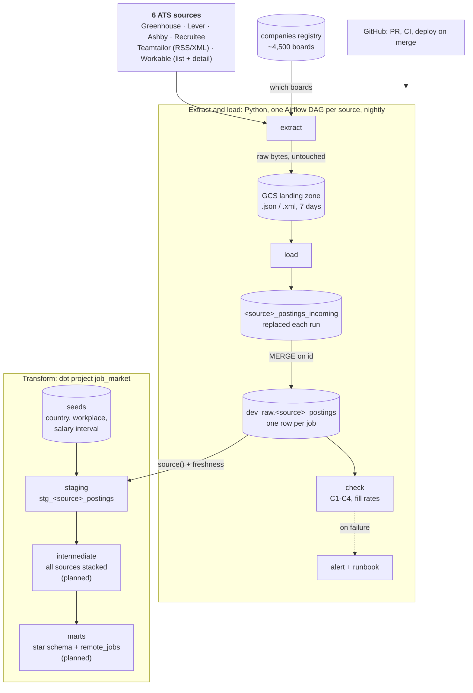

# job-market-pipeline

**Purpose:** help a job seeker find high-quality roles — ones that match what they're
looking for, such as remote-only, country and language — across company career boards.

A batch data pipeline that collects public job postings from applicant-tracking systems
(ATS), lands the raw responses in Google Cloud Storage, loads them into BigQuery, and
transforms them with dbt into one canonical model.

**Status:** six sources - Greenhouse, Lever, Ashby, Recruitee, Teamtailor and Workable -
each loaded and quality-checked nightly by its own Airflow DAG; ~4,500 company boards. dbt
transformation layer in progress (staging for two of the six sources).

## Architecture


```mermaid
flowchart TB
    SRC["<b>6 ATS sources</b><br/>Greenhouse · Lever · Ashby · Recruitee<br/>Teamtailor (RSS/XML) · Workable (list + detail)"]
    REG[("companies registry<br/>~4,500 boards")]

    subgraph ING["Extract and load: Python, one Airflow DAG per source, nightly"]
        direction LR
        EX["extract"] -->|"raw bytes, untouched"| GCS[("GCS landing zone<br/>.json / .xml, 7 days")]
        GCS --> LD["load"]
        LD --> INC[("&lt;source&gt;_postings_incoming<br/>replaced each run")]
        INC -->|"MERGE on id"| RAW[("dev_raw.&lt;source&gt;_postings<br/>one row per job")]
        RAW --> CK["check<br/>C1-C4, fill rates"]
        CK -.->|on failure| ALERT["alert + runbook"]
    end

    subgraph DBT["Transform: dbt project job_market"]
        direction LR
        SEEDS[("seeds<br/>country, workplace,<br/>salary interval")] --> STG["staging<br/>stg_&lt;source&gt;_postings"]
        STG --> INT["intermediate<br/>all sources stacked<br/>(planned)"]
        INT --> MRT["marts<br/>star schema + remote_jobs<br/>(planned)"]
    end

    SRC --> EX
    REG -->|which boards| EX
    RAW -->|"source() + freshness"| STG
    GIT["GitHub: PR, CI, deploy on merge"] -.-> ING
```

**Two halves.** The **Python + Airflow** half extracts and loads: every source's response is
kept untouched in GCS, then flattened into a raw BigQuery table per source, each in its own
vocabulary. The **dbt** half transforms: staging models translate each source into canonical
names and values (via seed tables), so they can be stacked into one model of the job market.

The same three steps run for every source. What is shared lives in one module per step;
each source only supplies what genuinely differs.

1. **Extract** (`ingestion/ats.py` + `ingestion/<source>.py`): reads the boards to collect
   from a BigQuery registry table and calls the source's public API for each one. The
   response bytes are stored unchanged in GCS at
   `<source>/ingest_date=YYYY-MM-DD/<board>/<time>.json`. A source module is one fetch
   function - retries, landing, progress and the failure summary are shared.
2. **Load** (`ingestion/loader.py` + `ingestion/<source>_loader.py`): lists everything that
   landed for the day, flattens each job with the source's `transform`, stamps the pipeline's
   own timestamps, and batch-loads the rows into a staging table.
3. **Merge** (`sql/merge_<source>_postings.sql`): upserts staging into the final table by
   job `id`.
4. **Check** (`ingestion/checks.py`): blocking checks (every board landed or failed
   explainably, staging rebuilt from today's files, unique keys, merge applied) and a fill
   rate per column, with the column list read from `INFORMATION_SCHEMA`.
5. **Transform** (`job_market/`, dbt): one staging model per source renames columns to the
   canonical model and translates each source's vocabulary (country names, remote words, pay
   periods) through seed tables; HTML descriptions become plain text through a tested macro.
   Tests (unique keys, accepted values, unmapped values, seed coverage) run with every build.
   Next: stack the six sources into one model, then marts. See [job_market/README.md](job_market/README.md).


## Design decisions

- **ELT with an untouched landing zone.** Raw API responses are stored byte for byte,
before any parsing, so anything downstream can be rebuilt from them. A lifecycle rule
deletes landed files after **7 days**, which keeps storage inside the free tier and limits
how far back a rebuild can reach. The landing path is partitioned by date first, then
company, so the loader can process "everything that landed today" without knowing the
company list in advance.
- **The BigQuery raw table is the current state, not the history.** The table holds one row
per job, upserted with `MERGE`, rather than one row per job per run.
`first_seen_at` is set once and `last_seen_at` is updated on every run. This keeps the
table from growing by a near-duplicate copy of every open job each day.
- **Idempotent loads.** BigQuery does not enforce primary keys, so rerunning a naive insert
creates duplicates. Instead, each run fully replaces a staging table (`WRITE_TRUNCATE`)
and then runs `MERGE`, which is safe to repeat.
- **Retries and reruns can't create duplicates.** If an extract runs more than once in a
day, the same job appears in several landed files. Each staging row records `landed_at`
(the GCS object's creation time). The `MERGE` source keeps only the newest copy of each
job (`QUALIFY ROW_NUMBER() OVER (PARTITION BY id ORDER BY landed_at DESC) = 1`), so the
merge never sees two candidates for one target row.
- **Batch load jobs, not streaming inserts.** The data is daily and nothing needs low
latency. Load jobs are also free, which fits a free-tier budget.
- **Explicit schemas.** Tables are created from the DDL in `sql/`, and loads use
`autodetect=False`. With autodetection on, a column that happened to be all `NULL` in a
batch was once inferred as `STRING` instead of the declared `TIMESTAMP`.
- **Share what varies, not what is "common".** Values that differ per source become
parameters; behaviour that differs (how to fetch, how to flatten) is passed in as a function.
Adding Ashby took one fetch function, one `transform`, two DDL files and a MERGE column list.
- **The landing zone keeps each source's own format.** JSON lands as `.json`, Teamtailor's
RSS as `.xml` - the extension and content type are a parameter of the shared landing code.
- **Incremental where the source forces it.** Workable's job list has no descriptions; one
request per job every night would be ~29k requests. The extract asks BigQuery which jobs it
already holds and details only the rest (at most 3,000 per run, refreshed after 30 days). The
MERGE updates description columns only from rows that carried a detail, so a quiet night
never blanks them.
- **Raw tables keep each source's own vocabulary.** Lever says `Full-Time`, Ashby
`FullTime`; Lever's country is `US`, Ashby's `USA`. Values are stored as published and
mapped once, downstream, in the canonical model - documented per column in the DDL.
- **Configuration comes from the environment.** Bucket and dataset names are never in the
code. They are read from environment variables, and the process fails immediately if one
is missing (`os.environ[...]`, not `.get`). The GCP project comes from the environment's
credentials. SQL that must run against different datasets is a template (`{dataset}`)
that Python fills in, because BigQuery query parameters can't be used for table names.


## Repository layout

```
dags/
  <source>_dag.py          one DAG per source: extract >> load >> check, on the run's logical date
ingestion/
  ats.py                   shared extract: registry -> fetch -> GCS, failure summary
  loader.py                shared load: GCS -> staging (batched) -> MERGE
  checks.py                shared data-quality checks and fill rates
  <source>.py              per source: how to fetch one board
  <source>_loader.py       per source: how to flatten one payload into rows
  alerts.py, dates.py      failure callback; logical-date validation
scripts/
  seed_companies.py        validate board slugs against the API, then add them to the registry
sql/
  create_*.sql             table DDL, with table and column descriptions (run once, by hand)
  merge_<source>_postings.sql   MERGE template, run by the loader
tests/                     pure unit tests (no mocks) for transforms and check logic
job_market/                dbt project
  models/staging/          stg_<source>_postings + sources, tests and docs in YAML
  seeds/                   mapping tables (country, workplace, salary interval)
  macros/                  html_to_text
  tests/                   singular tests (unmapped values, seed coverage, leftover HTML)
scripts/generate_country_seed.py   builds the country seed from observed values + ISO 3166
```


## Running it locally

Requirements: Python 3.13, a GCP project with a GCS bucket and a BigQuery dataset, and
credentials available to the Google client libraries (for example
`gcloud auth application-default login`, or `GOOGLE_APPLICATION_CREDENTIALS` pointing to a
service-account key).

```bash
python -m venv venv && source venv/bin/activate
pip install -r requirements.txt

export NAME_BUCKET=<your-landing-bucket>
export NAME_DATASET=<your-raw-dataset>

# once: create the tables (the DDL uses the dev_raw dataset); repeat per source
bq query --use_legacy_sql=false < sql/create_dev_raw_companies.sql
bq query --use_legacy_sql=false < sql/create_dev_raw_greenhouse_postings.sql
bq query --use_legacy_sql=false < sql/create_dev_raw_greenhouse_postings_incoming.sql

# register boards: a JSON list of slugs, validated against the API before insert
python scripts/seed_companies.py greenhouse slugs.json --insert

# one day, by hand (always pass the date: the default is the local date, not UTC)
D=$(date -u +%F)
python -m ingestion.greenhouse $D          # extract and land
python -m ingestion.greenhouse_loader $D   # load and merge
python -m ingestion.checks greenhouse $D   # checks and fill rates
```


## Operations

- **Schedule:** one DAG per source, staggered so they never compete for the host:
  `greenhouse_ingestion` 01:30, `lever_ingestion` 02:30, `ashby_ingestion` 03:30,
  `recruitee_ingestion` 04:30, `teamtailor_ingestion` 05:30, `workable_ingestion` 06:30 UTC, all
  `catchup=False`. Tasks: `extract >> load >> check`; the extract's and the load's summaries
  reach `check` via XCom.
- **Runs on:** a self-hosted Airflow 3 (Docker, LocalExecutor). Deploys happen automatically
  when `main` changes, after the tests and DAG-import checks pass.
- **Dependencies:** the Greenhouse, Lever, Ashby and Recruitee public job-board APIs Teamtailor's RSS feeds and Workable's job-board API · a GCS bucket for landed files ·
  BigQuery (`companies` registry in, postings out). No other pipeline depends on this one yet.
- **Retries:** each task retries twice, 5 minutes apart, with a 45-minute timeout (120 for
  Recruitee, which has ~1,500 boards; 90 for Teamtailor). The check
  task does not retry - re-running a check on unchanged data only delays the alert.
- **When it fails:** see [RUNBOOK.md](RUNBOOK.md) - what each failure means, what to check,
  what to do.

## Roadmap

- [x] Greenhouse, multiple companies, end to end, idempotent
- [x] Airflow DAG (self-hosted, Docker) running the daily extract → load → merge
- [x] Hardening: data-quality checks, retries and timeouts, failure alerts, tests, CI/CD, type checking
- [x] Scale to hundreds of companies (batched loads; 5 → 212 → 485 Greenhouse boards)
- [x] Second, third and fourth sources: Lever, Ashby and Recruitee (multilingual postings),
      sharing extract, load and checks; board lists grown from a web-crawl index, validated first
- [x] Fifth source: Teamtailor, an RSS/XML feed - landed as `.xml`, parsed with namespaces,
      with a tripwire against the feed's hidden 100-item default cap
- [x] Sixth source: Workable - incremental extraction (descriptions need one request per job,
      so only jobs not yet held are detailed, capped per run, with a circuit breaker for the
      API's rate limit)
- [~] dbt: canonical model across sources — project, sources with freshness, seeds, an
      HTML-to-text macro and staging for Lever and Ashby done; four staging models, the
      unioned model and the marts (a star schema + a wide `remote_jobs` table) to go
- [ ] Separate dev and prod environments
- [ ] Serving layer / dashboard


### Known issues

- **The raw layer is deliberately permissive.** Only what the pipeline itself guarantees is
`NOT NULL` (id, raw payload, timestamps); everything the source provides may be null, because a
`NOT NULL` on someone else's API is a promise that eventually breaks. Completeness is reported
as a fill rate per column on every run instead of blocking the load.
- **Landed files are deleted after 7 days** by a lifecycle rule, so a rebuild can only reach
back that far.
- **Failures are logged, not pushed.** A failure callback writes a structured alert line with
everything needed to act (and `RUNBOOK.md` says what to do), but nothing sends it anywhere yet;
in a team this would post to a chat channel.


## License

MIT, see [LICENSE](LICENSE).