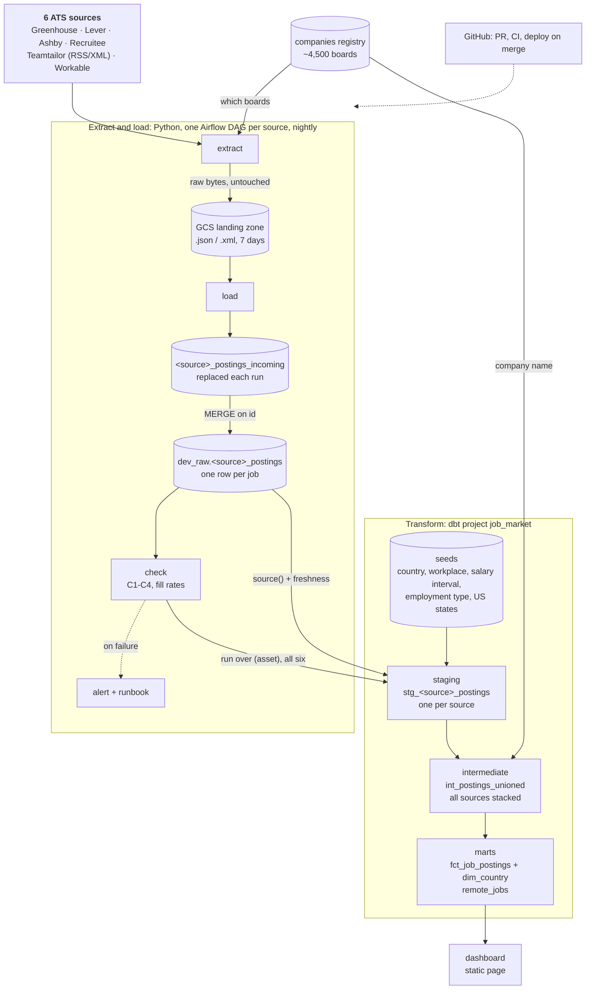

# job-market-pipeline

**Purpose:** help a job seeker find high-quality roles — ones that match what they're
looking for, such as remote-only, country and language — across company career boards.

A batch data pipeline that collects public job postings from applicant-tracking systems
(ATS), lands the raw responses in Google Cloud Storage, loads them into BigQuery, and
transforms them with dbt into one canonical model.

**Status:** six sources - Greenhouse, Lever, Ashby, Recruitee, Teamtailor and Workable -
each loaded and quality-checked nightly by its own Airflow DAG; ~4,500 company boards and
~120,000 open postings. dbt turns them into one model: a staging model per source, one model
that stacks all six, and the first marts - a small star schema and a `remote_jobs` table.
The reasoning behind the main choices is in [docs/decisions](docs/decisions/README.md).

**Live dashboard:** <https://phmsales1996.github.io/job-market-pipeline/> - open remote
postings by region, country, company and employment type, a searchable list of the latest
ones, and the pipeline's own numbers. It is written as code ([dashboard/](dashboard/README.md))
and built from the marts.

## Architecture


```mermaid
flowchart TB
    SRC["<b>6 ATS sources</b><br/>Greenhouse · Lever · Ashby · Recruitee<br/>Teamtailor (RSS/XML) · Workable"]
    REG[("companies registry<br/>~4,500 boards")]

    subgraph ING["Extract and load: Python, one Airflow DAG per source, nightly"]
        direction LR
        EX["extract"] -->|"raw bytes, untouched"| GCS[("GCS landing zone<br/>.json / .xml, 7 days")]
        GCS --> LD["load"]
        LD --> INC[("&lt;source&gt;_postings_incoming<br/>replaced each run")]
        INC -->|"MERGE on id"| RAW[("dev_raw.&lt;source&gt;_postings<br/>one row per job")]
        RAW --> CK["check<br/>C1-C4, fill rates"]
        CK -.->|on failure| ALERT["alert + runbook"]
    end

    subgraph DBT["Transform: dbt project job_market"]
        direction LR
        SEEDS[("seeds<br/>country, workplace, salary interval,<br/>employment type, US states")] --> STG["staging<br/>stg_&lt;source&gt;_postings<br/>one per source"]
        STG --> INT["intermediate<br/>int_postings_unioned<br/>all sources stacked"]
        INT --> MRT["marts<br/>fct_job_postings + dim_country<br/>remote_jobs"]
    end

    SRC --> EX
    REG -->|which boards| EX
    RAW -->|"source() + freshness"| STG
    REG -->|company name| INT
    CK -->|"run over (asset), all six"| STG
    MRT --> DASH["dashboard<br/>static page"]
    GIT["GitHub: PR, CI, deploy on merge"] -.-> ING
```

**Two halves.** The **Python + Airflow** half extracts and loads: every source's response is
kept untouched in GCS, then flattened into a raw BigQuery table per source, each in its own
vocabulary. The **dbt** half transforms: staging models translate each source into canonical
names and values (via seed tables); one intermediate model stacks them into a single table
of the job market; marts serve it.

The same three steps run for every source. What is shared lives in one module per step;
each source only supplies what genuinely differs.

1. **Extract** (`ingestion/ats.py` + `ingestion/<source>.py`): reads the boards to collect
   from a BigQuery registry table and calls the source's public API for each one. The
   response bytes are stored unchanged in GCS at
   `<source>/ingest_date=YYYY-MM-DD/<board>/<time>.json`. A source module is one fetch
   function - retries, landing, progress and the failure summary are shared.
2. **Load** (`ingestion/loader.py` + `ingestion/<source>_loader.py`): lists everything that
   landed for the day, flattens each job with the source's `transform`, stamps what only the
   pipeline knows - its timestamps and the board the file came from - and batch-loads the rows
   into a staging table.
3. **Merge** (`sql/merge_<source>_postings.sql`): upserts staging into the final table by
   job `id`.
4. **Check** (`ingestion/checks.py`): blocking checks (every board landed or failed
   explainably, staging rebuilt from today's files, unique keys, merge applied) and a fill
   rate per column, with the column list read from `INFORMATION_SCHEMA`.
5. **Transform** (`dbt/`, the dbt project), in three layers:
   - **Staging**, one model per source: renames columns to the canonical model and translates
     each source's vocabulary (country names, remote words, pay periods, employment types)
     through seed tables. HTML descriptions become plain text through a tested macro. Where a
     source has no field - the largest one has no country and no workplace type - the value
     is derived from free text under a narrow, documented rule, or left unknown.
   - **Intermediate**: `int_postings_unioned` stacks the six staging models into one row per
     posting and adds the company name from the registry.
   - **Marts**: `fct_job_postings` and `dim_country` (a small star schema, with country names
     and regions), and `remote_jobs`, a wide table of remote postings ready to query.
6. **Show** (`dashboard/`): a dashboard written as one text file of queries and charts, built
   into a static page from the marts.

   About 80 tests run with every build: unique keys, accepted values, values a seed has never
   seen, seed coverage, leftover markup. See [dbt/README.md](dbt/README.md).


## Design decisions

The decisions below concern the extract-and-load half. The modelling decisions - how each
source's words are translated, when a value is derived and when it is left unknown, why the
marts are shaped as they are - are written up one per page in
[docs/decisions](docs/decisions/README.md).

- **ELT with an untouched landing zone.** Raw API responses are stored byte for byte,
before any parsing, so anything downstream can be rebuilt from them. A lifecycle rule
deletes landed files after **7 days**, which keeps storage inside the free tier and limits
how far back a rebuild can reach. The landing path is partitioned by date first, then
company, so the loader can process "everything that landed today" without knowing the
company list in advance.
- **The BigQuery raw table is the current state, not the history.** The table holds one row
per job, upserted with `MERGE`, rather than one row per job per run.
`first_seen_at` is set once and `last_seen_at` is updated on every run. This keeps the
table from growing by a near-duplicate copy of every open job each day.
- **Idempotent loads.** BigQuery does not enforce primary keys, so rerunning a naive insert
creates duplicates. Instead, each run fully replaces a staging table (`WRITE_TRUNCATE`)
and then runs `MERGE`, which is safe to repeat.
- **Retries and reruns can't create duplicates.** If an extract runs more than once in a
day, the same job appears in several landed files. Each staging row records `landed_at`
(the GCS object's creation time). The `MERGE` source keeps only the newest copy of each
job (`QUALIFY ROW_NUMBER() OVER (PARTITION BY id ORDER BY landed_at DESC) = 1`), so the
merge never sees two candidates for one target row.
- **Batch load jobs, not streaming inserts.** The data is daily and nothing needs low
latency. Load jobs are also free, which fits a free-tier budget.
- **Explicit schemas.** Tables are created from the DDL in `sql/`, and loads use
`autodetect=False`. With autodetection on, a column that happened to be all `NULL` in a
batch was once inferred as `STRING` instead of the declared `TIMESTAMP`.
- **Share what varies, not what is "common".** Values that differ per source become
parameters; behaviour that differs (how to fetch, how to flatten) is passed in as a function.
Adding Ashby took one fetch function, one `transform`, two DDL files and a MERGE column list.
- **The landing zone keeps each source's own format.** JSON lands as `.json`, Teamtailor's
RSS as `.xml` - the extension and content type are a parameter of the shared landing code.
- **Change the request before scheduling around a limit.** Workable's job list had no
descriptions, so the first design fetched one detail per job, incrementally. Its rate limit
allowed about 300 details per window against about 660 new postings a night, which no schedule
can catch up with. The list request returns the description when asked, so the detail calls
were switched off ([decision 0009](docs/decisions/0009-workable-descriptions-from-the-list.md)).
- **Raw tables keep each source's own vocabulary.** Lever says `Full-Time`, Ashby
`FullTime`; Lever's country is `US`, Ashby's `USA`. Values are stored as published and
mapped once, downstream, in the canonical model - documented per column in the DDL.
- **Configuration comes from the environment.** Bucket and dataset names are never in the
code. They are read from environment variables, and the process fails immediately if one
is missing (`os.environ[...]`, not `.get`). The GCP project comes from the environment's
credentials. SQL that must run against different datasets is a template (`{dataset}`)
that Python fills in, because BigQuery query parameters can't be used for table names.


## Repository layout

```
dags/
  <source>_dag.py          one DAG per source: extract >> load >> check, on the run's logical date
ingestion/
  ats.py                   shared extract: registry -> fetch -> GCS, failure summary
  loader.py                shared load: GCS -> staging (batched) -> MERGE
  checks.py                shared data-quality checks and fill rates
  <source>.py              per source: how to fetch one board
  <source>_loader.py       per source: how to flatten one payload into rows
  alerts.py, dates.py      failure callback; logical-date validation
scripts/
  seed_companies.py        validate board slugs against the API, then add them to the registry
sql/
  create_*.sql             table DDL, with table and column descriptions (run once, by hand)
  merge_<source>_postings.sql   MERGE template, run by the loader
tests/                     pure unit tests (no mocks) for transforms and check logic
dbt/                       dbt project (named job_market)
  models/staging/          stg_<source>_postings (six) + sources, tests and docs in YAML
  models/intermediate/     int_postings_unioned: all sources stacked, company name joined
  models/marts/            dim_country, fct_job_postings, remote_jobs
  seeds/                   mapping tables (country spellings, countries and regions, workplace,
                           salary interval, employment type, US states)
  macros/                  html_to_text
  tests/                   singular tests (unmapped values, seed coverage, leftover HTML)
dashboard/                 the dashboard as code (Quarto): index.qmd holds the queries and charts
docs/decisions/            design decisions, one short record each
scripts/generate_country_seed.py   builds both country seeds from observed values + ISO 3166
```


## Running it locally

Requirements: Python 3.13, a GCP project with a GCS bucket and a BigQuery dataset, and
credentials available to the Google client libraries (for example
`gcloud auth application-default login`, or `GOOGLE_APPLICATION_CREDENTIALS` pointing to a
service-account key).

```bash
python -m venv venv && source venv/bin/activate
pip install -r requirements.txt

export NAME_BUCKET=<your-landing-bucket>
export NAME_DATASET=<your-raw-dataset>

# once: create the tables (the DDL uses the dev_raw dataset); repeat per source
bq query --use_legacy_sql=false < sql/create_dev_raw_companies.sql
bq query --use_legacy_sql=false < sql/create_dev_raw_greenhouse_postings.sql
bq query --use_legacy_sql=false < sql/create_dev_raw_greenhouse_postings_incoming.sql

# register boards: a JSON list of slugs, validated against the API before insert
python scripts/seed_companies.py greenhouse slugs.json --insert

# one day, by hand (always pass the date: the default is the local date, not UTC)
D=$(date -u +%F)
python -m ingestion.greenhouse $D          # extract and land
python -m ingestion.greenhouse_loader $D   # load and merge
python -m ingestion.checks greenhouse $D   # checks and fill rates
```


## Operations

- **Transform:** `dbt_transform` has no clock schedule. Each ingestion DAG ends with a task that
  announces its run is over, whether it succeeded or failed, and `dbt_transform` runs
  `dbt build` once all six have announced (Airflow assets).
- **Schedule:** one DAG per source, staggered so they never compete for the host:
  `greenhouse_ingestion` 01:30, `lever_ingestion` 02:30, `ashby_ingestion` 03:30,
  `recruitee_ingestion` 04:30, `teamtailor_ingestion` 05:30, `workable_ingestion` 06:30 UTC, all
  `catchup=False`. Tasks: `extract >> load >> check`; the extract's and the load's summaries
  reach `check` via XCom.
- **Runs on:** a self-hosted Airflow 3 (Docker, LocalExecutor). Deploys happen automatically
  when `main` changes, after the tests and DAG-import checks pass.
- **Dependencies:** the Greenhouse, Lever, Ashby and Recruitee public job-board APIs Teamtailor's RSS feeds and Workable's job-board API · a GCS bucket for landed files ·
  BigQuery (`companies` registry in, postings out). No other pipeline depends on this one yet.
- **Retries:** each task retries twice, 5 minutes apart, with a 45-minute timeout (120 for
  Recruitee, which has ~1,500 boards; 90 for Teamtailor). The check
  task does not retry - re-running a check on unchanged data only delays the alert.
- **When it fails:** see [RUNBOOK.md](RUNBOOK.md) - what each failure means, what to check,
  what to do.

## Roadmap

- [x] Greenhouse, multiple companies, end to end, idempotent
- [x] Airflow DAG (self-hosted, Docker) running the daily extract → load → merge
- [x] Hardening: data-quality checks, retries and timeouts, failure alerts, tests, CI/CD, type checking
- [x] Scale to hundreds of companies (batched loads; 5 → 212 → 485 Greenhouse boards)
- [x] Second, third and fourth sources: Lever, Ashby and Recruitee (multilingual postings),
      sharing extract, load and checks; board lists grown from a web-crawl index, validated first
- [x] Fifth source: Teamtailor, an RSS/XML feed - landed as `.xml`, parsed with namespaces,
      with a tripwire against the feed's hidden 100-item default cap
- [x] Sixth source: Workable - first with an incremental detail fetch, then, once its rate
      limit proved impossible to keep up with, with descriptions taken from the list request
- [x] Every posting tied to its company (the board identifier, stamped by the loader)
- [x] dbt: staging for all six sources, with seeds, an HTML-to-text macro and ~80 tests
- [x] dbt: one model of every posting (`int_postings_unioned`)
- [x] dbt: first marts - `fct_job_postings`, `dim_country` with regions, `remote_jobs`
- [x] Open or closed: whether a posting was seen in its source's latest run
- [x] dbt on Airflow: the models rebuild and their tests run when the six ingestion runs are
      over, triggered by assets rather than a clock time
- [ ] Alerts routed to a channel, including "nothing ran"
- [ ] Company dimension, with history
- [ ] History of postings (daily snapshot) and trend marts
- [x] Dashboard on the marts, written as code and published as a static page
- [ ] Rebuild and publish the dashboard nightly, after the models
- [ ] Job family, seniority and skills, by rules first and then a language model, with an
      evaluation set
- [ ] dbt in CI; separate dev and prod environments; infrastructure as code
- [ ] Port the dbt project to a second warehouse


### Known issues

- **The raw layer is deliberately permissive.** Only what the pipeline itself guarantees is
`NOT NULL` (id, raw payload, timestamps); everything the source provides may be null, because a
`NOT NULL` on someone else's API is a promise that eventually breaks. Completeness is reported
as a fill rate per column on every run instead of blocking the load.
- **Landed files are deleted after 7 days** by a lifecycle rule, so a rebuild can only reach
back that far.
- **No history yet.** The raw tables hold each posting's current state, so a change to a
posting overwrites what was there, and nothing records how many postings were open on a past
day.
- **CI does not build the dbt models.** It runs the Python tests, the DAG import check and the
type check. The models are rebuilt and tested nightly on the Airflow host instead.
- **A source DAG that never runs blocks the transform silently.** The transform waits for all
six sources to announce that their run is over; a paused DAG never does.
- **One environment.** The dataset is named in dbt's source file and in the DDL files; there
is no separate production target, and the cloud resources were created by hand.
- **Company names are mostly derived from the board identifier** (`acme-corp` becomes
"Acme Corp"), except where the source's API reports a name.
- **Failures are logged, not pushed.** A failure callback writes a structured alert line with
everything needed to act (and `RUNBOOK.md` says what to do), but nothing sends it anywhere yet;
in a team this would post to a chat channel.


## License

MIT, see [LICENSE](LICENSE).